<div align="center">

# NexBoot：无盘启动服务器（PXE + iSCSI + ZFS）

**一份母镜像，让整间网吧、机房的 Windows / Linux 电脑都从网络启动。单个 Go 二进制，自带 Web 管理界面，可扩展为高可用集群。**

[English](README.md) · **简体中文**

[](https://github.com/waterlemon0108/nexboot/stargazers)

[](./LICENSE)
[](https://go.dev/)
[](#环境要求)
[](https://github.com/waterlemon0108/nexboot/actions/workflows/ci.yml)

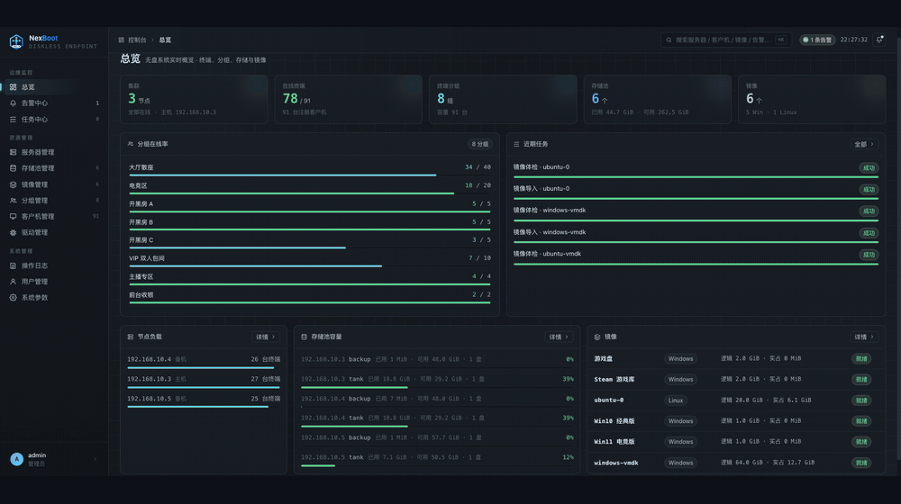

</div>

---

## 目录

- [简介](#简介)
- [核心特性](#核心特性)
- [演示图](#演示图)
- [架构](#架构)
- [环境要求](#环境要求)
- [安装](#安装)
- [首次配置](#首次配置)
- [高可用集群](#高可用集群)
- [开发](#开发)
- [项目结构](#项目结构)
- [参与贡献](#参与贡献)
- [许可证](#许可证)

---

## 简介

无盘启动（diskless boot）让客户机不带本地系统盘：开机时经 PXE / iPXE 从服务器引导，运行期间根磁盘通过 iSCSI 挂在服务器上。管理员只维护一份母镜像，NexBoot 为每台客户机克隆出一块**独立可写**的盘，客户机之间互不影响；客户机重启即回到所用还原点的干净状态。

**部署与运维以 Web 界面为主**：每台服务器只需执行一条安装命令，建存储池、导入镜像、分组、登记客户机、组建集群、计划切换等操作均在管理界面完成，无需重启服务。

## 核心特性

| 能力 | 说明 |
|---|---|
| 单二进制交付 | 静态编译、内嵌 Web UI；提供 deb 包与离线依赖包，适用于隔离机房 |
| 镜像 → 客户机克隆 | 支持 Windows / Ubuntu 镜像（见[客户机镜像要求](#客户机镜像要求)），BIOS 与 UEFI 启动；ZFS 写时复制克隆 + 内核 LIO iSCSI 导出 |
| 镜像 / 配置 / 还原点 | 一个镜像可有多套配置，每套配置可有多个还原点；支持一键应用、另存为新镜像、导出为镜像文件、覆盖原镜像 |
| 数据盘与超管机 | 分组可挂载数据盘；超管机直接修改配置并保存为新还原点 |
| 驱动管理 | 驱动包导入、INF 解析与启动驱动集管理 |
| 告警与审计 | 节点、存储池、复制、客户机启动失败、镜像体检等告警；操作日志与登录日志 |
| 高可用 | keepalived 虚 IP + ZFS 目录复制 + epoch 栅栏；从单机在线扩展到多节点，不重装、不迁移数据 |
| 安全 | iSCSI CHAP（按 MAC 认证）、`/boot` 来源地址核对 |

## 演示图

| | |
|:---:|:---:|
| [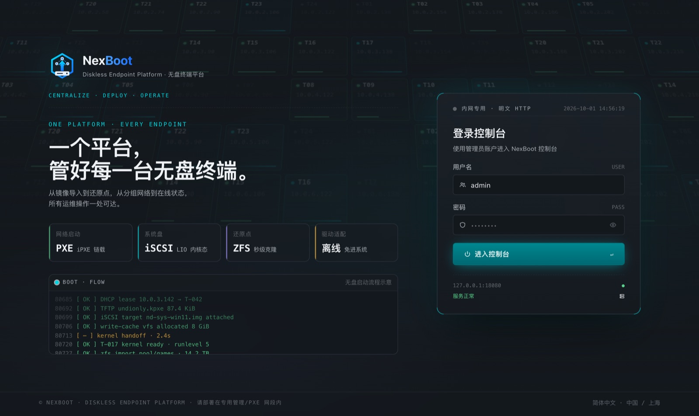](docs/images/demo/login.jpg)<br/>登录 | [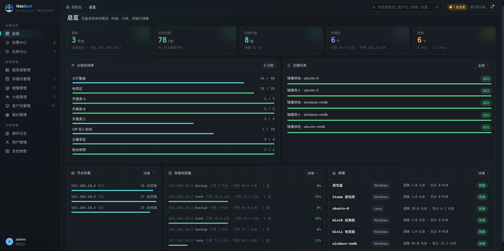](docs/images/demo/overview.jpg)<br/>总览：集群、终端、分组、存储一屏可见 |
| [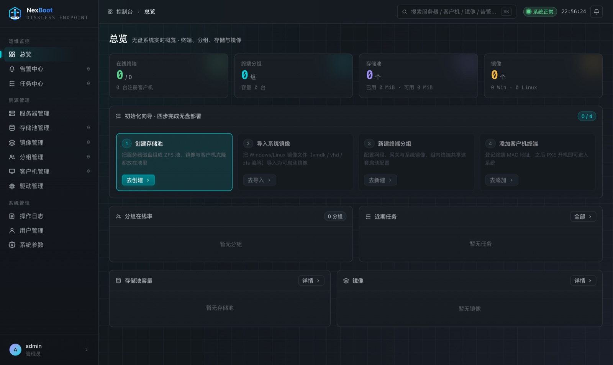](docs/images/demo/setup-wizard.jpg)<br/>首次登录的初始化向导 | [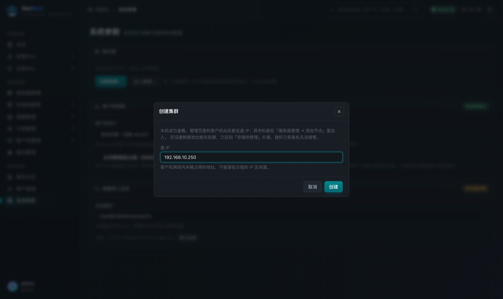](docs/images/demo/create-cluster.jpg)<br/>创建集群：只填一个虚 IP |
| [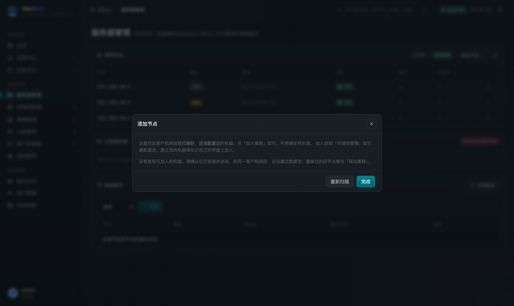](docs/images/demo/add-node.jpg)<br/>添加节点：自动扫出待加入的服务器 | [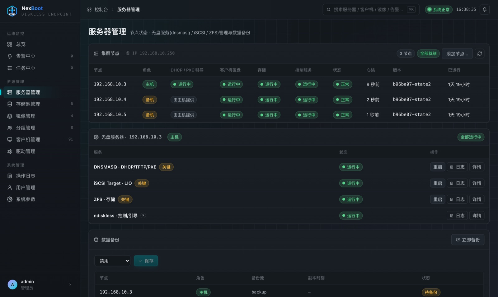](docs/images/demo/servers.jpg)<br/>服务器管理：集群节点与无盘服务 |
| [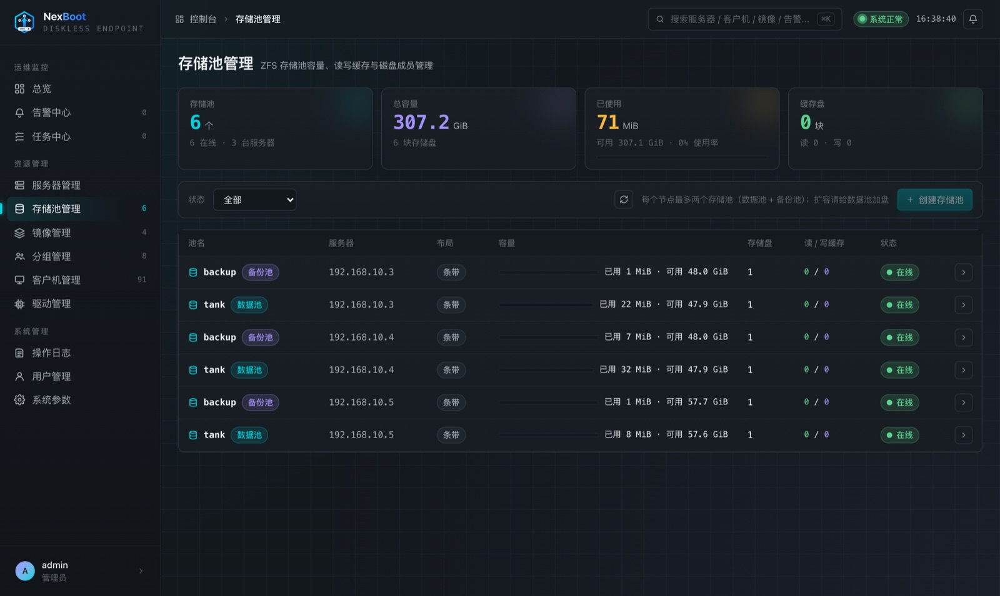](docs/images/demo/storage.jpg)<br/>存储池管理：各节点的数据池与备份池 | [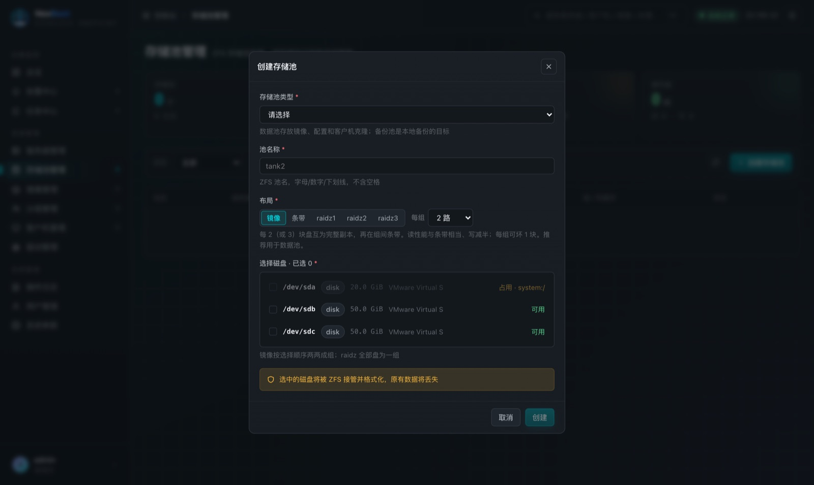](docs/images/demo/create-pool.jpg)<br/>创建存储池 |
| [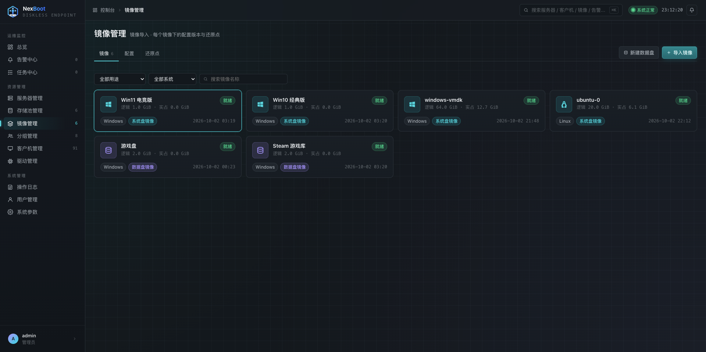](docs/images/demo/images.jpg)<br/>镜像管理：系统盘与数据盘 | [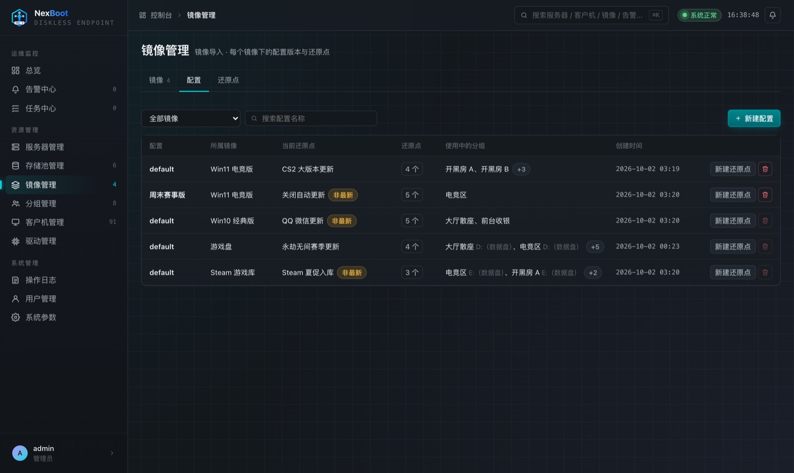](docs/images/demo/configs.jpg)<br/>配置：一个镜像多套配置 |
| [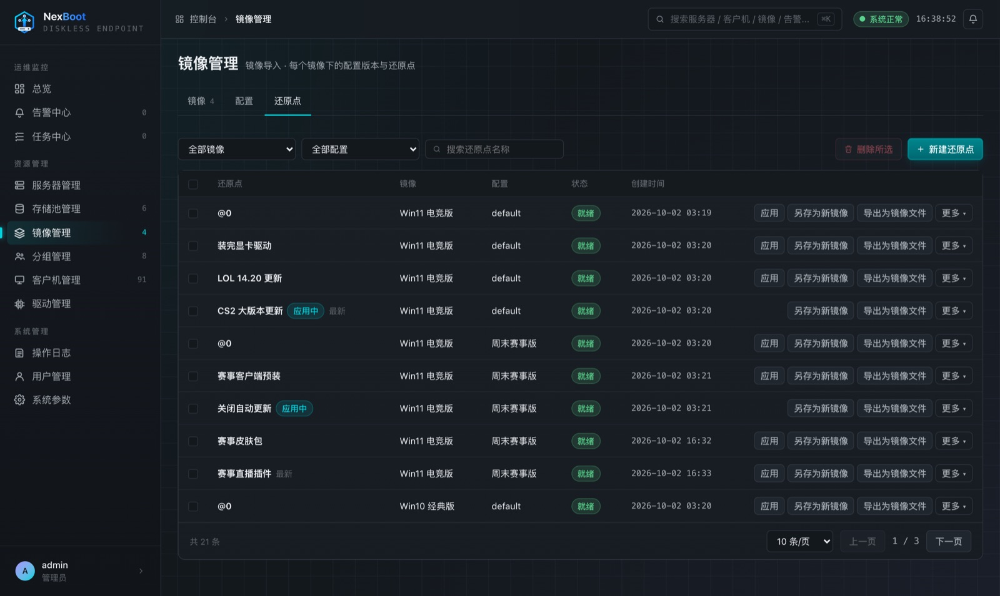](docs/images/demo/restore-points.jpg)<br/>还原点：应用、另存为新镜像、导出 | [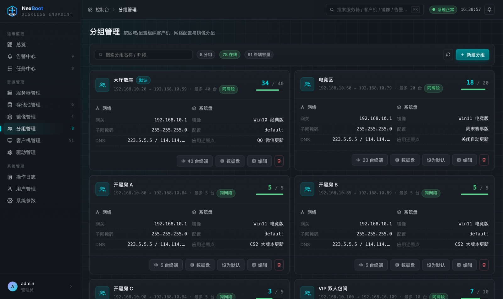](docs/images/demo/groups.jpg)<br/>分组管理：网段、系统盘与数据盘 |
| [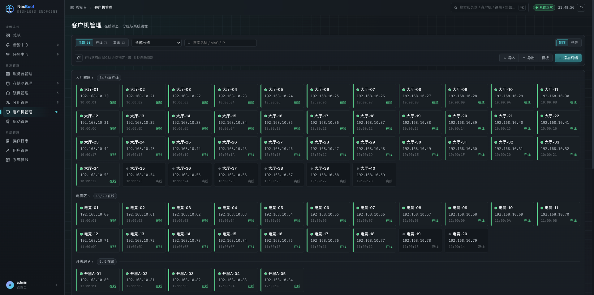](docs/images/demo/terminals.jpg)<br/>客户机矩阵 | [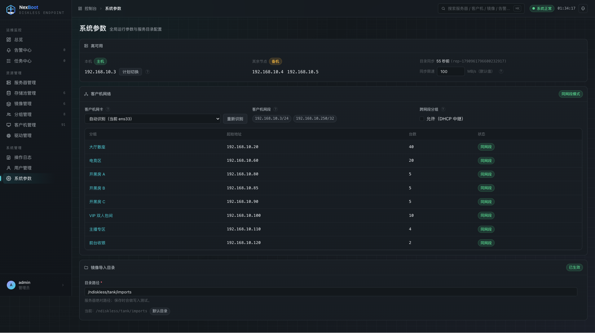](docs/images/demo/params-ha.jpg)<br/>系统参数：高可用、客户机网络 |
| [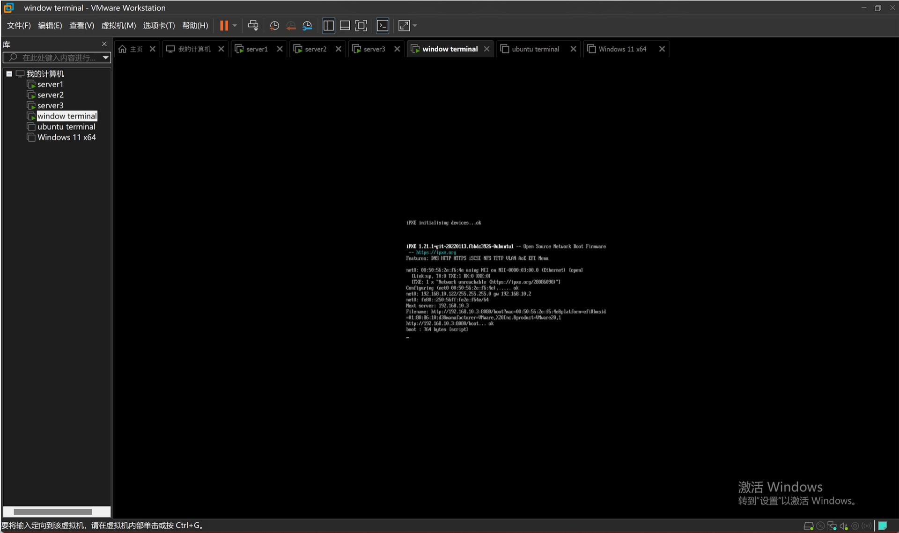](docs/images/demo/client-windows-ipxe.jpg)<br/>Windows 客户机：iPXE 从服务器取得开机脚本（UEFI） | [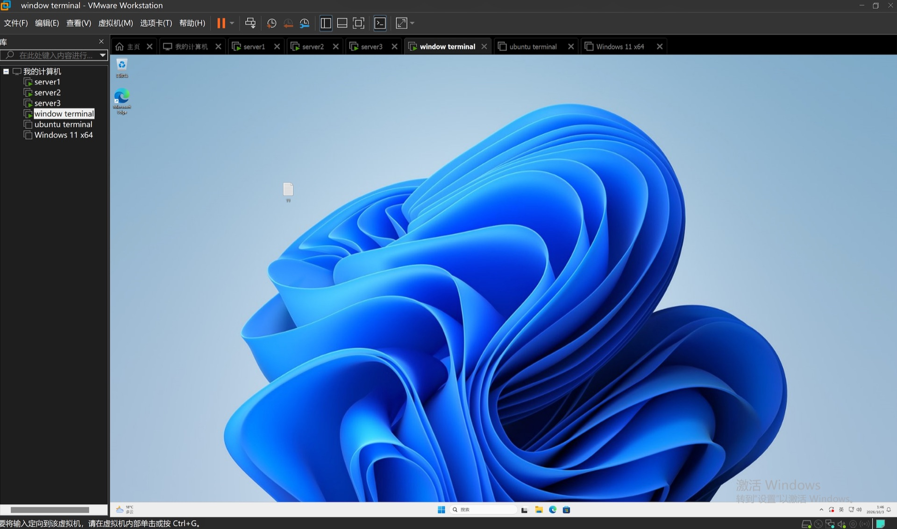](docs/images/demo/client-windows-desktop.jpg)<br/>Windows 11 客户机无盘进入桌面 |
| [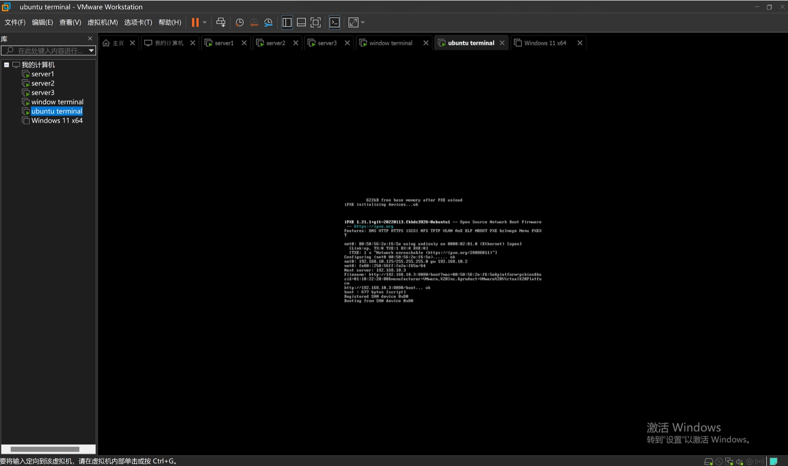](docs/images/demo/client-ubuntu-ipxe.jpg)<br/>Ubuntu 客户机：挂上 iSCSI 系统盘并从中引导（BIOS） | [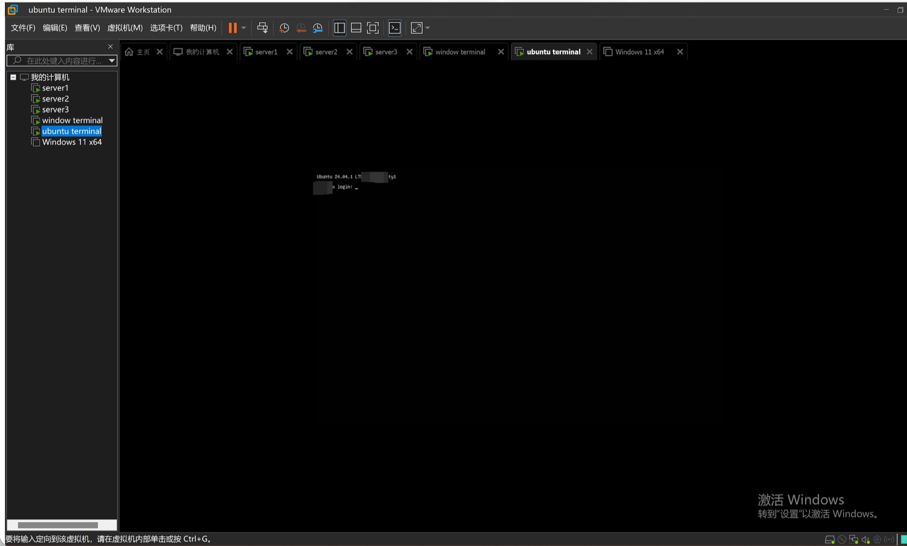](docs/images/demo/client-ubuntu-login.jpg)<br/>Ubuntu 24.04 客户机无盘启动到登录界面 |

## 架构

单进程内聚多个子系统，对外只暴露一个 HTTP 端口和一套内核/系统依赖：

| 层 | 组件 | 说明 |
|---|---|---|
| 接入 | HTTP API + 嵌入式 Web UI | `internal/api`、`web/`（前端 `go:embed` 进二进制） |
| 引导 | `/boot`（iPXE 脚本）、TFTP 资产 | iPXE undionly/snponly/wimboot 内嵌，启动时写入 `/srv/tftp` |
| 控制 | 镜像/配置/还原点/分组/客户机/驱动/告警/备份 | `internal/control`；放置决策 `internal/control/place` |
| 存储 | ZFS 池与克隆、iSCSI 导出（LIO） | `internal/storage/{zfs,iscsi,local,remote}` |
| DHCP | dnsmasq 配置生成与托管 | `internal/dhcp` |
| 目录库 | SQLite（分组/客户机/用户/设置/HA 状态） | `internal/store`，goose 迁移 |
| 高可用 | 角色状态机、复制、epoch 栅栏 | `internal/ha`、`internal/control/ops`（Replicator）；keepalived 模板在 `deploy/` |

**数据面直连**：客户机的 DHCP / `/boot` / iSCSI 走承载它的那个节点（集群里由“放置”决定是哪台），不经控制面中转。

## 环境要求

**每台服务器**

| 项目 | 要求 |
|---|---|
| 操作系统 | Ubuntu 22.04 / 24.04（其它 systemd + ZFS 发行版同理） |
| 磁盘 | 系统盘之外至少一块**独立数据盘**用于 ZFS 存储池 |
| 内存 | 最低 8 GB，推荐 32 GB 以上（按常用镜像总量能放进 ZFS ARC 估算） |
| 网络 | 与客户机处于**同一二层网段**；集群各节点也须在该网段（VRRP 心跳经此网卡） |
| IP 地址 | 每台服务器都要用**静态 IP**，不能用 DHCP |
| 运行依赖 | `dnsmasq`、`dnsmasq-utils`、`qemu-utils`、`targetcli-fb`、`zfsutils-linux`、`keepalived`、`curl`（deb 包自动拉取，离线包已内置） |

**网络环境**

- 客户机网段内**不得有其它 DHCP 服务器**为客户机发放地址：NexBoot 的 DHCP 只应答已登记的客户机，其它 DHCP 服务器同时应答会导致客户机拿错地址、无法引导。
- 客户机 BIOS 设置为网卡（PXE）启动，BIOS 与 UEFI 模式均可。

> **克隆的虚拟机或模板装机**：每台服务器的 `/etc/machine-id` 必须唯一（节点身份由它派生）。从同一模板克隆的机器需先重置：
>
> ```sh
> sudo rm -f /etc/machine-id /var/lib/dbus/machine-id
> sudo systemd-machine-id-setup
> sudo ln -sf /etc/machine-id /var/lib/dbus/machine-id
> sudo reboot
> ```

### 客户机镜像要求

| 系统 | 支持情况 | 制作镜像前需要做的 |
|---|---|---|
| Windows | 支持 | 网卡设为自动获取 IP；Windows 11 24H2 / 25H2 须为 26100.7705 / 26200.7705 及以上版本 |
| Ubuntu | 支持 | 安装 open-iscsi：`sudo apt install open-iscsi` |
| CentOS / RHEL / Rocky 等其它 Linux | 未适配、未验证 | 见下方「其它 Linux」 |

- **Windows 11 24H2 / 25H2**：部分版本有 iSCSI 启动失败的已知问题（蓝屏 `INACCESSIBLE_BOOT_DEVICE`，常见表现是第一次能进系统、重启后进不去），微软在 [KB5074105](https://support.microsoft.com/en-us/topic/january-29-2026-kb5074105-os-builds-26200-7705-and-26100-7705-preview-85bd25de-894a-43eb-a19b-9a59d10f194b) 中修复。
- **不要在镜像里设置静态 IP。** 所有客户机共用同一份镜像，写死的地址会被每台同时占用；如果撞上服务器的地址，客户机还会断开自己的系统盘。客户机的固定 IP 在分组里分配，由 NexBoot 的 DHCP 按 MAC 下发。Ubuntu 镜像导入时会自动把 netplan / NetworkManager 中的静态配置改为 DHCP（原文件备份为 `.nd-bak`）；Windows 镜像请在制作前手动改为自动获取。
- Ubuntu 的根分区可以是普通分区，也可以在 **LVM** 上（Ubuntu Server 默认安装方式，`/boot` 单独分区也支持）；只支持普通（linear）逻辑卷，精简卷、RAID 卷暂不支持。
- **其它 Linux**（CentOS / RHEL / Rocky 等）：导入时不做自动适配，也没有经过实测。按 RHEL 的 iSCSI 引导方式，原机上至少需要配好以下几项，不保证一定能启动：
  1. 安装 iSCSI 工具，并把 iSCSI 模块打进 initramfs：`dnf install iscsi-initiator-utils && dracut --add "iscsi network" -f --regenerate-all`
  2. 内核参数加上 `rd.iscsi.ibft=1 rd.iscsi.firmware=1 ip=ibft rd.neednet=1`（`grubby --update-kernel=ALL --args="..."`）
  3. 网卡改为 DHCP，不写静态 IP
  4. 数据盘不会自动挂载，需要在客户机里自行配置
- 导入后请查看镜像的**体检结果**：体检会检查分区格式、引导方式，以及 Linux 镜像能否从 iSCSI 挂载根分区。

## 安装

每台服务器执行相同的安装步骤。安装完成后即为一台**独立节点**；是否组成集群在界面中决定，见[高可用集群](#高可用集群)。

### 方式一：deb 包（推荐）

```sh
sudo apt install ./ndiskless_<版本>_amd64.deb
sudo ndiskless-configure --bootstrap-password '<管理员密码>'
```

### 方式二：离线包（无外网的机房）

```sh
mkdir nexboot && tar -xzf nexboot-offline-ubuntu24.04-amd64.tar.gz -C nexboot && cd nexboot
sudo ./install.sh
sudo ndiskless-configure --bootstrap-password '<管理员密码>'
```

安装包的构建方法见[开发](#开发)（`make deb` / `make offline`，须在与目标机同版本的 Ubuntu 上构建离线包）。

### 方式三：源码 / tarball（开发环境）

先安装[开发](#开发)中列出的构建依赖。

```sh
make build-static
sudo bash scripts/install-go.sh --install-deps --binary ./bin/ndiskless-linux-amd64 \
  --bootstrap-password '<管理员密码>'
```

### 验证

```sh
systemctl is-active ndiskless            # 应为 active
curl -s http://127.0.0.1:8080/healthz    # 应为 {"status":"ok"}（尚未建存储池时同样返回 ok）
```

浏览器访问 `http://<服务器IP>:8080`，使用用户名 `admin` 和安装时设置的密码登录。

> **升级**：安装新版本 deb 后服务**不会自动重启**，需执行 `sudo systemctl restart ndiskless`。集群环境先逐台升级备机，最后升级主机。

## 首次配置

以下步骤在管理界面完成，括号内为菜单路径。

| 步骤 | 菜单路径 | 操作 |
|---|---|---|
| 1. 确认客户机网卡 | 系统管理 → 系统参数 → 客户机网络 | 选择面向客户机的网卡；分组网段须落在该网卡所在网段内 |
| 2. 创建存储池 | 资源管理 → 存储池管理 → 创建存储池 | 选择数据盘与布局，池名自定（如 `tank`） |
| 3. 导入镜像 | 资源管理 → 镜像管理 → 导入镜像 | 从本机上传或从服务器目录选择镜像文件；导入时自动完成 iSCSI 启动适配 |
| 4. 新建分组 | 资源管理 → 分组管理 → 新建分组 | 设置 IP 区间、网关，选择系统镜像与配置，按需添加数据盘 |
| 5. 登记客户机 | 资源管理 → 客户机管理 → 添加终端 | 填写 MAC 地址并选择分组；**未登记的客户机不会获得地址，也无法引导** |

完成后客户机从网卡启动即可进入系统。之后对系统的修改通过「超管机」完成并保存为还原点，再在 **镜像管理 → 还原点** 中应用，客户机下次开机生效。

## 高可用集群

### 部署形态

| | 单机 | 双机热备 | 三节点及以上 |
|---|---|---|---|
| 管理写入 | 本机 | 主机（备机只读跟随） | 主机（其余节点只读跟随） |
| 客户机磁盘由谁提供 | 本机 | 两台自动均衡，可按分组固定 | 各节点自动均衡，可按分组固定 |
| 单节点故障影响 | 全部客户机 | 仅该节点承载的客户机重启一次 | 仅该节点承载的客户机重启一次 |
| 目录副本 | 1 份 | 2 份 | 每节点 1 份全量 |

**故障切换的预期**：属于分钟级自动恢复，而非无缝切换。主机故障时，**正在运行的客户机会蓝屏并自动重启一次**，重启后由新主机继续服务；未开机的客户机不受影响。虚 IP 约 1 秒内漂移，管理界面与新客户机引导数秒内恢复。

### 组建集群

所有节点先按[安装](#安装)完成安装。示例地址：节点 1 `192.168.10.3`、节点 2 `192.168.10.4`、虚 IP `192.168.10.250`。

1. **在节点 1 创建集群**：系统管理 → 系统参数 → 高可用 → 创建集群，填写虚 IP。虚 IP 须在客户机网段内、未被占用、且不在任何分组的 IP 区间内；集群令牌由系统自动生成。约十几秒后改用 `http://192.168.10.250:8080` 访问管理界面，此后所有操作都经虚 IP 进行。
2. **添加节点**：资源管理 → 服务器管理 → 集群节点 → 添加节点。系统扫描客户机网段，列出已安装但尚未配置的服务器，点击「加入集群」，该节点自动重启为备机。
3. **为每个节点创建存储池**：存储池管理 → 创建存储池，在「建在哪台」中依次选择各节点（含节点 1）。各节点池名相互独立，可以不同。节点 1 建池之前没有可复制的内容，备机暂时无法接管。
4. **等待首轮复制完成**：在 系统参数 → 高可用 中查看同步状态，追平后即可投入使用。

增加第三台及更多节点时重复第 2、3 步，已有节点无需任何操作。

**已有数据的单机升级为集群**：在该机上直接执行第 1 步，镜像、配置、分组、客户机均原样保留；新节点保持未配置状态，由它添加即可。

> 新节点的存储池容量须**不小于主机数据池的已用空间**，否则首轮复制无法完成。

### 日常运维

| 操作 | 菜单路径 | 说明 |
|---|---|---|
| 查看角色与同步状态 | 系统参数 → 高可用 | 各节点角色、复制延迟 |
| 调整复制限速 | 系统参数 → 高可用 → 同步限速 | 默认 100 MB/s；首轮全量复制耗时约为“已用空间 ÷ 限速”，中断后断点续传 |
| 计划切换 | 系统参数 → 高可用 → 计划切换 | 维护主机前使用；主机等所有在线备机追平后退位，不丢数据。运行中的客户机会重启一次，请选在空闲时段 |
| 分组固定到节点 | 分组管理 → 编辑 → 存储节点 | 下次开机生效，不搬移数据；该节点离线时自动回落到主机 |
| 节点与服务状态 | 服务器管理 | 各节点在线状态，dnsmasq / iSCSI / ZFS 服务的启停与日志，数据备份状态 |
| 下线节点 | 服务器管理 → 集群节点 → 移出集群 | 先将该机关机，待其显示离线后才可移出 |

**上线前建议做一次切换演练**：在主机上执行 `sudo systemctl stop ndiskless`，确认虚 IP 漂移到备机、管理界面数秒内恢复；随后启动原主机，它会自动以备机身份重新加入，不会抢回主机角色。需要换回时使用计划切换。

> 备机的管理界面为只读，页面顶部会提示主机地址。日常请始终通过虚 IP 访问。

## 开发

构建依赖：`go.mod` 指定的 Go 版本，以及 Node.js 22（至少 22.22.2）或 24（至少 24.15.0）与 npm。构建和验证目标会先执行 `npm ci`、生成 `web/dist`，再编译 Go 并嵌入前端；生成产物不提交到仓库。

```sh
make dev          # 本机开发二进制 bin/ndiskless-dev
make build        # 静态二进制 bin/ndiskless（GOOS/GOARCH 可覆盖）
make build-static # 发布用 linux/amd64 静态二进制 bin/ndiskless-linux-amd64
make web          # 构建前端（产物嵌入二进制）
make migrate      # 只跑数据库迁移
make verify       # 后端质量门：gofmt / vet / go test / 静态构建
make verify-web   # 前端质量门：vitest / vite build
make verify-all   # 全部质量检查，共用一次前端构建
make deb          # 打 .deb（须在 Linux 上，dpkg-deb）
make offline      # 打离线依赖包（须在与目标同版本的联网 Ubuntu 上）
```

- 版本号从 `git describe` 注入二进制（`ndiskless --version`）；deb 版本把 tag 后的 `-N-g<hash>` 转成 `~N-g<hash>`，让开发构建排在正式 tag 之下。
- 打包细节见 [`packaging/README.md`](packaging/README.md)。

## 项目结构

```
cmd/ndiskless/      程序入口、配置装配、HA 角色决定
internal/
  api/              HTTP 路由、鉴权、/boot、gate 中间件
  boot/             iPXE 脚本构建
  config/           环境变量读取
  control/          镜像/配置/还原点/分组/客户机/驱动/告警/备份、放置(place)、集群操作(ops)
  dhcp/             dnsmasq 配置生成
  domain/           领域模型
  ha/               角色状态机、epoch 栅栏、复制控制端点
  storage/          zfs / iscsi(LIO) / local / remote / agent
  store/            SQLite 仓储 + goose 迁移
web/                前端（go:embed 进二进制）
deploy/             systemd unit、keepalived 模板、健康/通知脚本
scripts/            install-go.sh（源码/--provisioned 安装配置逻辑）
packaging/          build-deb.sh、offline-bundle.sh、postinst/prerm
tools/e2e/          端到端功能矩阵与 run/ 编排
docs/images/        演示截图、GIF 与项目图片
```

## 参与贡献

欢迎提 Issue 和 Pull Request，流程见 [CONTRIBUTING.md](CONTRIBUTING.md)。

## 许可证

本项目采用 **GNU Affero General Public License v3.0（AGPLv3）** 授权，全文见 [`LICENSE`](./LICENSE)。

- 可以免费使用、学习、修改，包括在网吧、学校等场所运营使用。
- 修改后**分发**本软件，或修改后**通过网络对外提供服务**，必须以 AGPLv3 公开完整源码。
- **商标**：「NexBoot」名称与 Logo 不随本协议授权，未经许可不得用于衍生产品或服务的名称与宣传。
- 随程序分发的第三方组件（iPXE、wimboot 等）保留各自的协议，见 [`THIRD_PARTY_NOTICES.md`](./THIRD_PARTY_NOTICES.md)。

```
Copyright (C) 2026 NexBoot

This program is free software: you can redistribute it and/or modify
it under the terms of the GNU Affero General Public License as published
by the Free Software Foundation, either version 3 of the License, or
(at your option) any later version.

This program is distributed in the hope that it will be useful,
but WITHOUT ANY WARRANTY; without even the implied warranty of
MERCHANTABILITY or FITNESS FOR A PARTICULAR PURPOSE.  See the
GNU Affero General Public License for more details.
```

---

<div align="center">

由 [waterlemon0108](https://github.com/waterlemon0108) 开发。觉得有用的话，点个 Star 支持一下。

[](https://github.com/waterlemon0108/nexboot/stargazers)

</div>
